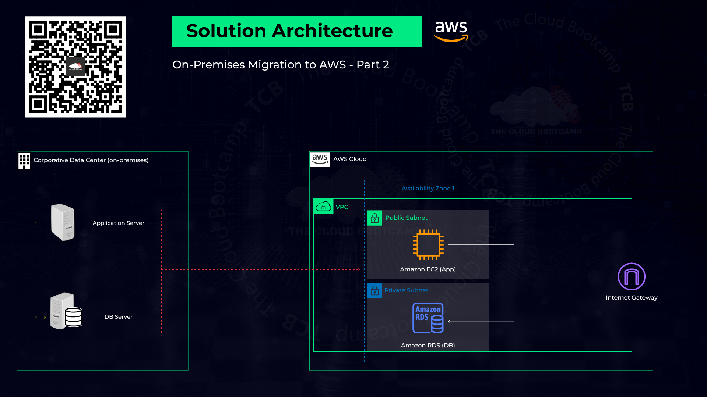

# Migration of a Workload from a Corporate Data Center to AWS using Amazon EC2 and RDS


## Project Overview
This project details the migration of an application and database from a corporate data center to AWS using the **Lift & Shift (rehost)** model. The migration process involved deploying the workload to **Amazon EC2** and **Amazon RDS**, ensuring seamless operation post-migration.



## Migration Steps
The migration was conducted in the following phases:
1. **Planning** – Sizing, prerequisites, and resource naming.
2. **Execution** – Provisioning resources and following best practices.
3. **Go-live** – Validation testing, dry-run, final migration (cutover).
4. **Post Go-live** – Ensuring application operation and user access.

---


### **Download File Created in Planing Phase:**  
[onpremises-migration-aws_abccompany-v1.xlsx](https://prod-files-secure.s3.us-west-2.amazonaws.com/0d1b678b-cd91-4256-93c7-73b2e82396d5/3bf35608-c885-4c2d-8e66-d74551937c3a/onpremises-migration-aws_abccompany-v1.xlsx)

---

## Part 1: Deployment - Creating EC2 and RDS Instances

### **VPC and Subnets Setup**
- **VPC Name:** vpc-bootcamp
- **CIDR Block:** 10.0.0.0/16 (No Overlap with On-prem)
- **Subnets:**
  - Public Subnet (us-east-1a, CIDR: 10.0.0.0/24)
  - Private Subnet (us-east-1a, CIDR: 10.0.1.0/24)
  - Private Subnet (us-east-1b, CIDR: 10.0.2.0/24)

### **EC2 Instance Setup**
- **Name:** awsuse1app01
- **OS:** Ubuntu 22.04 LTS
- **Instance Type:** t3.micro
- **Key Pair:** ec2-ssh (Save key in `c:\aws-mod3`)
- **Networking:**
  - VPC: vpc-bootcamp
  - Subnet: Public Subnet
  - Auto-assign public IP: Enabled
  - Security Group: app01-sg (Ports: 22, 8080)

### **RDS Database Setup**
- **Database Engine:** MySQL 5.7
- **DB Instance Name:** awsuse1db01
- **Instance Class:** db.t3.micro
- **Credentials:** admin/admin123456
- **Networking:**
  - VPC: vpc-bootcamp
  - Security Group: Default
  - AZ: us-east-1a
  - Port: 3306

---

## Part 2: Installing and Configuring Packages

### **Connect to EC2 Instance**
- Install Git Bash: [https://git-scm.com/downloads](https://git-scm.com/downloads)
- SSH into EC2:
  ```bash
  ssh -i ec2-ssh ubuntu@<EC2_PUBLIC_IP>
  ```

### **Configure Internet Gateway & Route Table**
- Attach an Internet Gateway (igw-mod3) to VPC
- Update Route Table to allow internet access:
  - Destination: `0.0.0.0/0`
  - Target: Internet Gateway (igw-mod3)

### **Install Required Dependencies**
```bash
sudo apt update
sudo apt install -y python3-dev python3-pip build-essential libssl-dev libffi-dev libmysqlclient-dev unzip
pip install Flask==2.3.3
pip3 install wtforms flask_mysqldb passlib
sudo apt-get install mysql-client -y
```

---

## Part 3: Go Live

### **Create Security Group for RDS**
- **Name:** EC2toRDS-sg
- **Inbound Rule:** Allow MySQL (3306) access from EC2

### **Modify RDS Security Group**
- Assign `EC2toRDS-sg` to `awsuse1db01`

### **Connect to RDS**
```bash
mysql -h <rds_endpoint> -P 3306 -u admin -p
```

### **Create & Import Database**
```sql
CREATE DATABASE wikidb;
USE wikidb;
SOURCE dump.sql;
```

### **Create MySQL User**
```sql
CREATE USER wiki@'%' IDENTIFIED BY 'admin123456';
GRANT ALL PRIVILEGES ON wikidb.* TO wiki@'%';
FLUSH PRIVILEGES;
```

### **Deploy Application**
```bash
wget https://tcb-bootcamps.s3.amazonaws.com/bootcamp-aws/en/wikiapp-en.zip
unzip wikiapp-en.zip
cd wikiapp
vi wiki.py  # Edit MySQL configurations and wiki user password
python3 wiki.py
```

### **Access the Application**
- Open `<EC2_PUBLIC_IP>:8080`
- Login with: admin/admin

---

## Post Go Live

### **Clean Up Resources**
- **Delete RDS Instance**
- **Terminate EC2 Instance**

---

## Project Evidence
- Add a new article:  
  _"I'm conquering the MultiCloud Universe and my name is **[Your Name]**!"_
- Validate successful migration.
  


## Conclusion
This project demonstrated the **Lift & Shift migration** of a workload from a corporate data center to AWS using EC2 and RDS. By following best practices and automation, we ensured a smooth transition with minimal downtime. 

