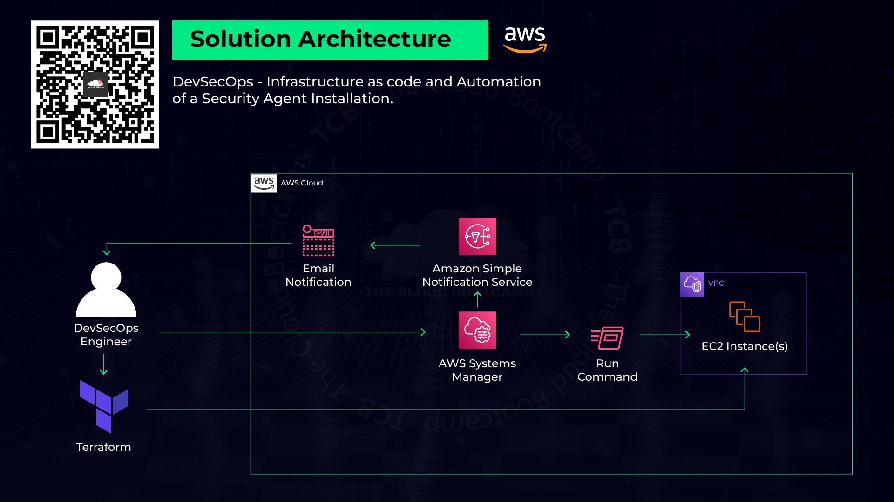

# Deploying EC2 Instances with Terraform, AWS Systems Manager, and SNS Notifications


## Introduction
This project automates the deployment of EC2 instances using Terraform (Infrastructure as Code — IaC). Additionally, it installs a security agent on all instances using AWS Systems Manager and configures Amazon Simple Notification Service (SNS) to notify stakeholders about the process status.



This README provides step-by-step instructions to successfully implement this project.

---

## **Part 1: Terraform — Infrastructure as Code**

### **1. Install VSCode and Terraform**
- Download VSCode: [VSCode Download](https://code.visualstudio.com/download)
- Install the Terraform Extension

### **2. Download and Configure Terraform Files**
- Download and unzip Terraform files: [aws-mod5.zip](https://prod-files-secure.s3.us-west-2.amazonaws.com/0d1b678b-cd91-4256-93c7-73b2e82396d5/b31a3d31-cc73-40c6-8c48-f0c867d91ae3/aws-mod5.zip)
- Update the **VPC_ID** and **SUBNET_ID** variables in `main.tf`.

### **3. Create an SSH Key Pair**
- Name: **sshkey1**
- Format: **.pem**

### **4. Upload Terraform Code to AWS Cloud Shell**
Install Terraform in AWS Cloud Shell:
```bash
sudo yum install -y yum-utils
sudo yum-config-manager --add-repo https://rpm.releases.hashicorp.com/AmazonLinux/hashicorp.repo
sudo yum -y install terraform
terraform -v
```

### **5. Run Terraform Commands**
```bash
terraform init
terraform plan
terraform apply
```
A new file `terraform.tfstate` will be created.

Learn more about Terraform:
- [Terraform Documentation](https://learn.hashicorp.com/terraform)
- [AWS Provider Docs](https://registry.terraform.io/providers/hashicorp/aws/latest/docs)

---

## **Part 2: AWS Systems Manager — Security Agent Installation**

### **1. Create IAM Role for Systems Manager to SNS**
1. Go to **IAM → Roles → Create Role**
2. Use case: **Systems Manager**
3. Attach policy: **AmazonSNSFullAccess**
4. Role Name: **SystemsManagerToSNS**

### **2. Create SNS Notification Topic**
1. Navigate to **SNS → Topics → Create Topic**
2. Type: **Standard**
3. Name: **DevOpsNotification**
4. Copy the ARN (e.g., `arn:aws:sns:us-east-1:937193033886:DevOpsNotification`)

### **3. Create an Email Subscription**
1. Go to **Create Subscription**
2. Protocol: **Email**
3. Enter your email
4. Confirm subscription from your email

### **4. Set Up AWS Systems Manager**
1. Go to **Systems Manager → Quick Setup**
2. Configuration type: **Host Management**
3. Targets: **Manual → Select Terraform-created instances**
4. Click **Create**
5. Wait **15 minutes** for configuration completion

### **5. Validate Setup**
1. Go to **Systems Manager → Session Manager → Start Session**
2. Select an instance and run:
```bash
cat /etc/*release*
ls -ltr /usr/bin/security_agent
```

---

## **Part 3: Deploy Security Agent Using AWS Systems Manager Run Command**

### **1. Execute Command for Security Agent Installation**
1. Navigate to **Systems Manager → Run Command → AWS-RunShellScript**
2. Enter the following script:
```bash
sudo wget -q https://tcb-bootcamps.s3.amazonaws.com/bootcamp-aws/en/install_security_agent.sh -P /tmp
sudo chmod +x /tmp/install_security_agent.sh
sudo /tmp/install_security_agent.sh
ls -ltr /usr/bin/security_agent
```
3. Targets: **Manually select all instances**
4. Enable SNS Notifications:
   - **IAM Role:** SystemsManagerToSNS
   - **SNS Topic:** `<ARN>` (e.g., `arn:aws:sns:us-east-1:510907048761:DevOpsNotification`)
   - **Events:** All Events
5. Click **RUN**

### **2. Verify Installation and Notifications**
- Check **Run Command Output** for success
- Verify **email notification** from SNS

---

## **Part 4: Clean-Up — Remove Resources**

### **1. Destroy Infrastructure**
```bash
terraform destroy
```

### **2. Delete Systems Manager Configuration**
1. Go to **Systems Manager → Quick Setup**
2. Select **Host Management → Delete Configuration**

### **3. Confirm Deletion**
1. Go to **Quick Setup → View Details → Delete Configuration**
2. Type `delete` and confirm

---

## **Conclusion**
In this project, we successfully deployed EC2 instances using Terraform, installed security agents using AWS Systems Manager, and configured SNS for notifications. This automation improves security compliance and operational efficiency in cloud environments.


