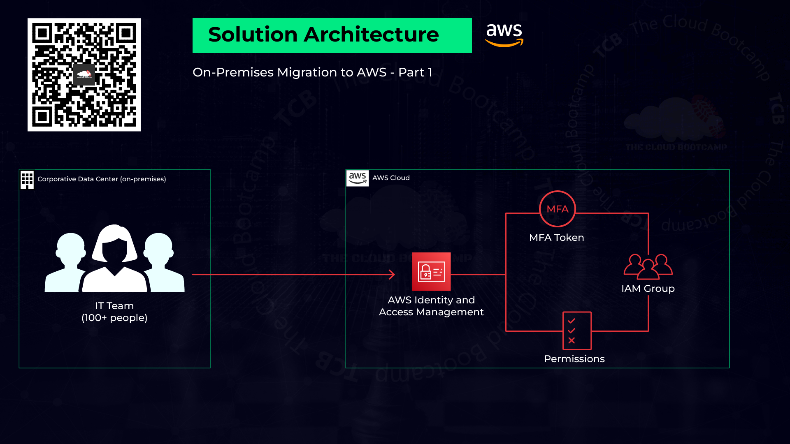

# Automated User Migration and Management of AWS IAM Resources


## Project Overview

In this project, based on a real-world scenario, I acted as a **Cloud Specialist** with the mission to migrate users in an automated way and manage **AWS IAM (Identity and Access Management) resources**.

There were **100 users** that needed to be migrated and have **MFA (Multi-Factor Authentication)** enabled on their accounts, as this is a security best practice.

To avoid repetitive and manual tasks in the AWS console, automation was necessary.

By employing **AWS CLI** and **Shell Scripts**, I successfully created a functional solution for the challenge. These tools enabled me to swiftly incorporate all 100 users into AWS IAM in a matter of seconds.



---

## Steps Implemented

### 1. Refinement of the CSV File Containing User Data

- Extracted a list of over 100 users, each with their designated work emails and roles.
- Organized this information into an Excel spreadsheet.
- Reformatted the data into a **CSV file**, specifying:
  - Usernames
  - Groups (aligned with pre-defined user groups in AWS)
  - Standardized temporary passwords

### 2. Creation of an Automated Script

- Developed a script using **GitBash, AWS CLI, and Shell Script**.
- The script:
  - Takes an uploaded CSV file
  - Converts it to Unix format
  - Migrates the users to AWS
  - Executes these operations for each line in the CSV file (excluding headers)

### 3. Enforce MFA Policy

- Implemented a **Multi-Factor Authentication (MFA)** policy in AWS IAM.
- Linked it to every IAM group to ensure enhanced security.
- Enabled **two-layer authentication** for all AWS account logins.

---

## Implementation Steps

1. **Create IAM User Groups**
   - Go to IAM in AWS Console.
   - Create user groups as defined in your refined CSV file (e.g., `user2.csv`).
2. **Attach Policies to Each Group**
   - Assign appropriate policies based on required permissions.
   - Example: Attach `AdministratorAccess` policy to `CloudAdmin` group.
3. **Upload Required Files**
   - Log in to AWS Console.
   - Upload the Shell script `aws-iam-create-user.sh` and `user2.csv` to your working directory.
4. **Run the Script**
   - Execute the following command to create users and associate them with the appropriate groups:
     ```sh
     ./aws-iam-create-user.sh user2.csv
     ```
5. **Enforce MFA Policy**
   - Navigate to **IAM > Policies**.
   - Create a new policy.
   - Copy JSON from `force_mfapolicy.json` and paste it into the policy editor.
   - Create and attach this MFA policy to all groups.

---

## Outcomes

- Automated migration of **100 users** to AWS IAM.
- Users added to IAM resources from the AWS console.
- **Eliminated manual user creation** and individual account configuration.
- Enforced **MFA for security best practices**.

---
