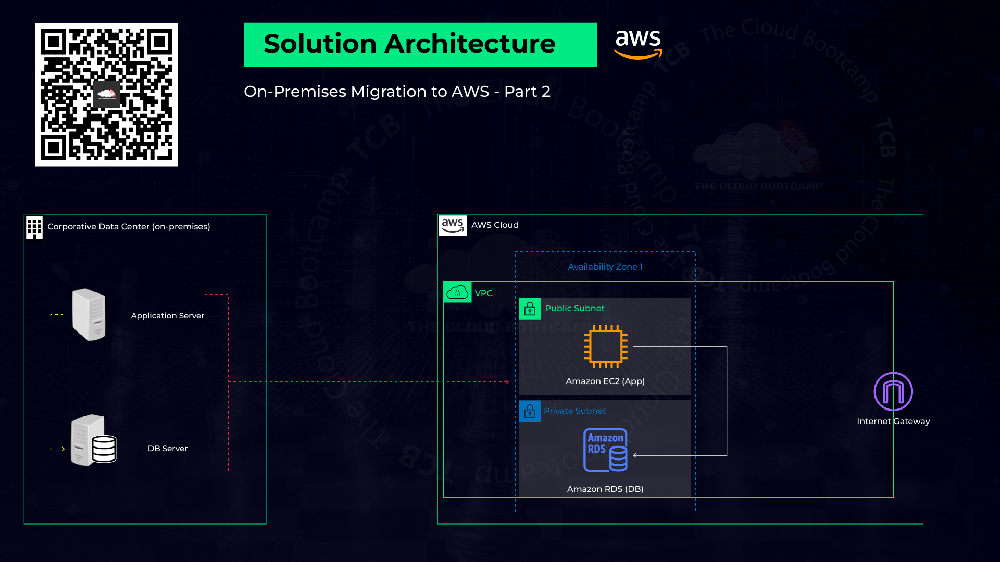
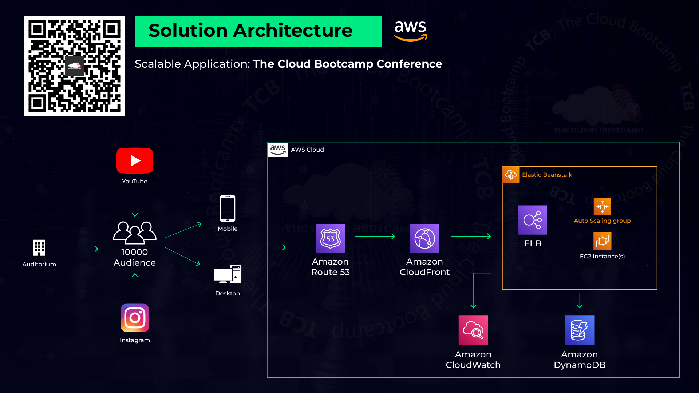
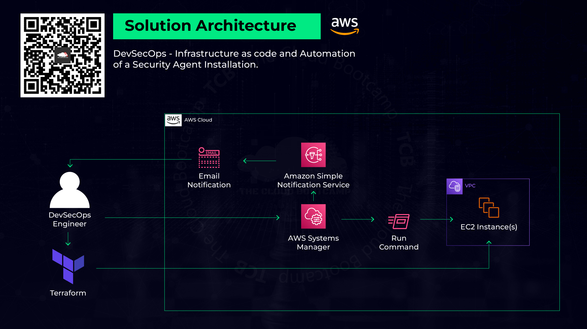
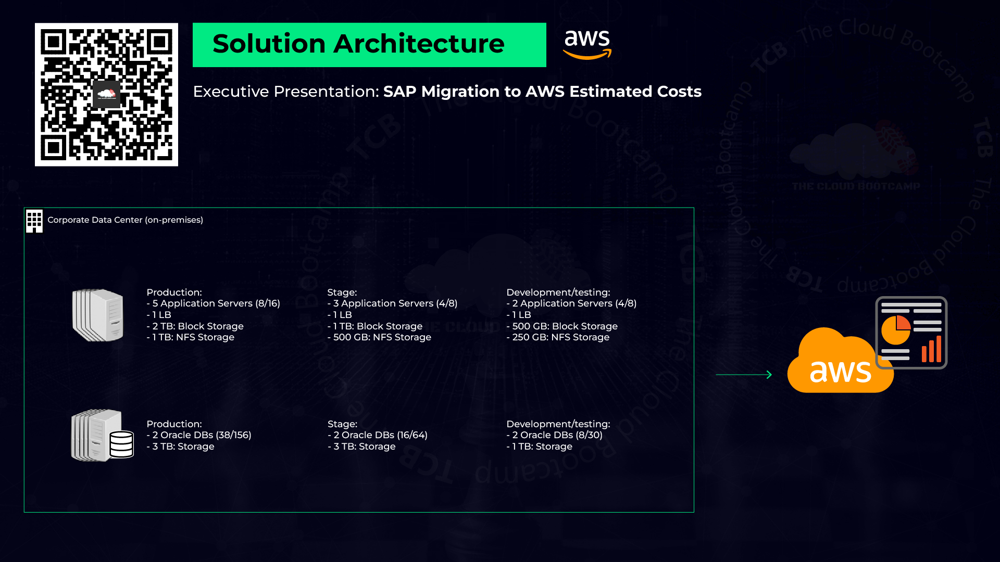

# AWS Bootcamp - Hands-on Projects

## Overview
This repository contains the hands-on projects completed as part of the **Amazon Web Services (AWS) Bootcamp** offered by **The Cloud Bootcamp**. The bootcamp is a hands-on specialization program focusing on AWS and Cloud Computing, with a total duration of **47 hours**.

## About the Bootcamp
The AWS Bootcamp provided an opportunity to acquire foundational knowledge of Amazon Web Services (AWS) and Cloud Computing. Throughout the program, several mini-projects were implemented based on real-world scenarios, covering key AWS services and best practices.

## Projects Implemented

### 1. **[Automated User Migration and IAM Resource Management](./IAM/Readme.md)**
- Developed an automated solution for user migration and management of AWS **Identity and Access Management (IAM)** resources.
- Ensured secure and efficient user provisioning and access control.
  
  

### 2. **[Workload Migration to AWS](./Corporate-DataCenter-Migration//Readme.md)**
- Migrated a workload running in a corporate data center to AWS.
- Utilized **Amazon EC2** for computing and **Amazon RDS** for database management.
- Improved scalability, availability, and cost efficiency.
  
  

### 3. **[Scalable Web Application Deployment](./Scalable-App//Readme.md)**
- Implemented a scalable web application using:
  - **AWS Elastic Beanstalk** for deployment and management.
  - **Amazon DynamoDB** for NoSQL database storage.
  - **Amazon CloudFront** and **Edge Locations** for content delivery.
- Achieved high availability and performance optimization.
  
  

### 4. **[Automated EC2 Instance Deployment & Security Setup](./DevSecOps/Readme.md)**
- Provisioned a set of EC2 instances using **Terraform**.
- Configured **AWS Systems Manager** for automated security installations.
- Integrated **Amazon Simple Notification Service (SNS)** for security alerts.
  
  

### 5. **[Executive Presentation of Infrastructure Costs](./SAP-Infrastructure-Migration-Costs/Readme.md)**
- Analyzed and presented the infrastructure cost estimates for an **SAP Migration project** from an on-premises environment to AWS.
- Provided cost breakdowns and optimization strategies.
  
  

### 6. **Final Project: Automated E-Commerce System Deployment**
- Designed and deployed a fully automated **E-Commerce System** on AWS.
- Leveraged **Terraform** and **Ansible** for Infrastructure as Code (IaC) and configuration management.
- Ensured seamless deployment, scalability, and security.

---

