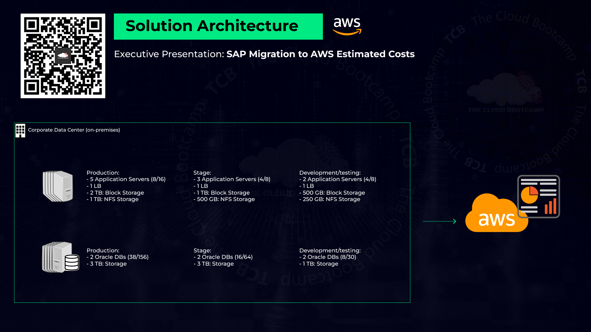
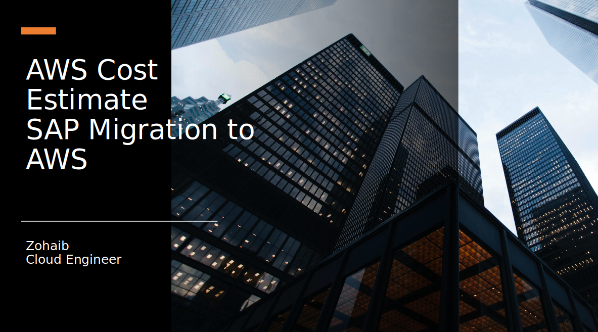

# SAP Migration from On-Premises to AWS: Executive Infrastructure Cost Presentation

## Overview
This document outlines the process of estimating infrastructure costs for migrating SAP workloads from an on-premises data center to AWS. The article walks through a real-world scenario where a Cloud Architect creates an executive presentation detailing the migration costs for three distinct SAP layers:

- **Production**
- **Quality Assurance (QA)**
- **Development/Test**

The goal is to provide a step-by-step guide to estimating costs using AWS services and the AWS Pricing Calculator, ensuring that the migration is both cost-effective and transparent.

## Key Sections

### 1. Project Overview
In this scenario, the role of the Cloud Architect is to estimate the infrastructure costs involved in migrating SAP workloads to AWS. The SAP environment is structured into three key layers:
- **Production**: This is the live environment where business-critical applications are running.
- **Quality Assurance (QA)**: A staging environment for testing and validation of SAP workloads.
- **Development/Test**: A non-production environment used for development and testing.

The goal was to estimate migration costs assuming a three-year operational period on AWS.

### 2. Step-by-Step Guide to Estimating Infrastructure Costs

#### Step 1: Use AWS Pricing Calculator
- **Action**: Open the [AWS Pricing Calculator](https://calculator.aws/#/), and click on **Create Estimate**.
- **Select Service**: Choose **On-Premises to AWS Migration**.
  
##### Estimated Services
- **Compute (EC2 & EBS)**: To estimate compute costs (EC2 instances and storage with EBS).
- **Storage (EFS)**: Estimate the cost of Network File System (NFS) using Amazon Elastic File System (EFS).

#### Step 2: Estimate Compute Costs (EC2 & EBS) for Production
- **Service**: Amazon EC2
- **Region**: South America (Business Decision)
- **Operating System**: Linux
- **Workloads**: Constant Usage
- **Instance Type**: `t3a.2xlarge` (8 vCPUs, 16 GB RAM)
- **Number of Instances**: 5

##### Storage Configuration
- **EBS Storage**: 
  - Storage Type: General Purpose SSD (gp2)
  - Storage per instance: 400 GB
  - Total Storage: 2TB

##### Savings Plan
- **Payment Option**: Compute Savings Plans (3 Years)
  
**Action**: Save and view the summary of compute costs.

#### Step 3: Estimate Load Balancer Costs
- **Service**: Application Load Balancer (ALB)
- **Number of Load Balancers**: 3
- **Capacity Units (LCUs)**:
  - Processed Data: 2GB/hour
  - Requests per Second: 100
  - Rule Evaluations per Request: 100

**Action**: Save and view the load balancer costs.

#### Step 4: Estimate Network File System (NFS) Costs
- **Service**: Amazon Elastic File System (EFS)
- **Region**: South America
- **Storage Type**: Standard Storage
- **Total Capacity**: 1.75TB

**Action**: Save and view the NFS costs.

#### Step 5: Estimate Costs for QA & Dev/Test Compute and Storage
- **Service**: Amazon EC2
- **Region**: South America
- **Instance Type**: `t3a.xlarge` (4 vCPUs, 8 GB RAM)
- **Number of Instances**: 5

##### Storage Configuration
- **EBS Storage**:
  - Storage per instance: 300 GB
  - Total Storage: 1.5TB

##### Savings Plan
- **Payment Option**: Compute Savings Plans (3 Years)

**Action**: Save and view the compute and storage costs for QA and Dev/Test.

#### Step 6: Estimate Costs for Oracle Database Services
##### Production Database
- **Service**: Amazon RDS for Oracle
- **Region**: South America
- **Instance Type**: `db.m4.10xlarge` (40 vCPUs, 160 GB RAM)
- **Number of Instances**: 2

##### Storage Configuration
- **Storage per instance**: 1.5TB
- **Backup Storage**: 3TB
- **Deployment**: Multi-AZ

##### QA Database
- **Service**: Amazon RDS for Oracle
- **Instance Type**: `db.m4.4xlarge` (16 vCPUs, 64 GB RAM)
- **Number of Instances**: 2

##### Storage Configuration
- **Storage per instance**: 1.5TB
- **Backup Storage**: 3TB
- **Deployment**: Single-AZ

##### Dev/Test Database
- **Service**: Amazon RDS for Oracle
- **Instance Type**: `db.m3.2xlarge` (8 vCPUs, 30 GB RAM)
- **Number of Instances**: 2

##### Storage Configuration
- **Storage per instance**: 500GB
- **Backup Storage**: 1TB
- **Deployment**: Single-AZ

**Action**: Save and view the summary for each database tier.

#### Step 7: Estimate AWS Support Costs
- **Service**: AWS Support
- **Plan**: Enterprise Support Plan
- **Response Time**: 15 minutes or less

**Action**: Save and view the summary for AWS Support costs.

### 3. Final Cost Summary & Presentation
After gathering all estimates, an executive presentation is created to visualize the total costs. This presentation summarizes the findings, providing a clear and detailed view of the costs for management to make informed decisions.

### 4. Conclusion
This project offers a comprehensive and cost-efficient approach to migrating SAP workloads to AWS. By following the structured steps outlined above, the migration ensures that infrastructure costs are estimated with accuracy, leveraging AWS services efficiently for high availability and optimized spending.

#### Key Takeaways:
- **Step-by-step cost estimation** using AWS Pricing Calculator.
- **Cost-efficient instance selection** with Compute Savings Plans for a three-year period.
- **Multi-AZ deployment** for production workloads to ensure high availability.
- **Flexible storage solutions** (EBS, EFS, and RDS) for different workload types.
- **Comprehensive AWS Support** ensures continuous business operations.

