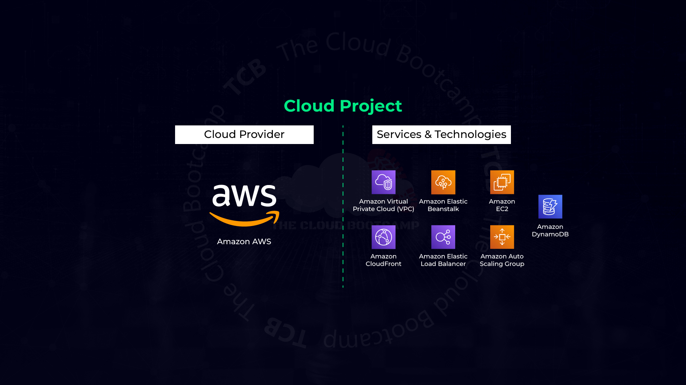
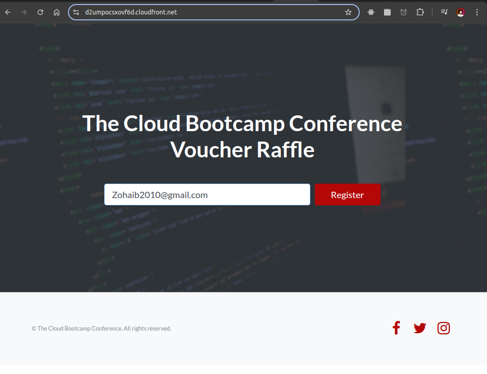
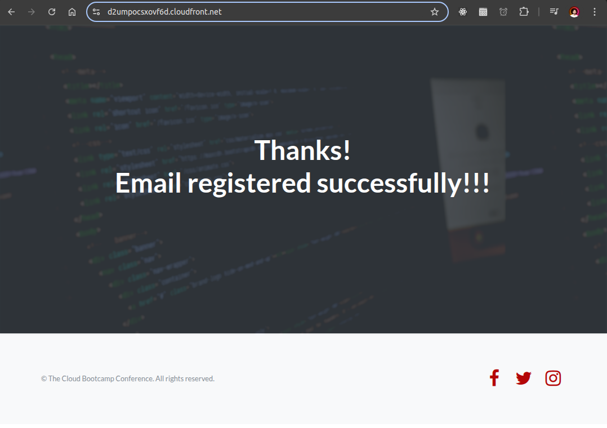
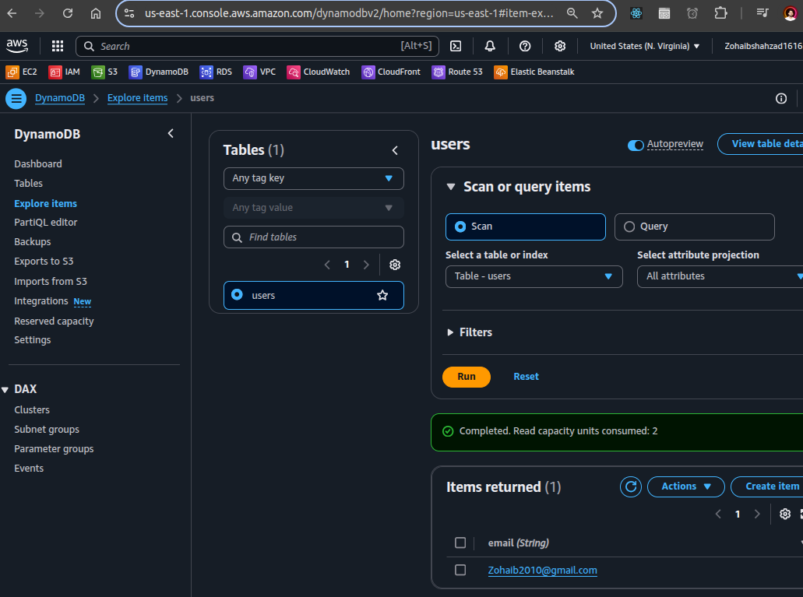

# Scalable Web Application Deployment with AWS Services




## Overview
This project demonstrates the deployment of a scalable web application using AWS services, including Elastic Beanstalk, DynamoDB, CloudFront, and Edge Locations. The application was built to support a high-demand event with over 10,000 users accessing it simultaneously.


## AWS Services Used
- **Elastic Beanstalk**: Managed service for application deployment.
- **DynamoDB**: NoSQL database for storing user email data.
- **CloudFront**: CDN for caching and accelerating content delivery.
- **Edge Locations**: Distributed endpoints for reduced latency.

## Deployment Steps
### Part 1: Deploying DynamoDB and Elastic Beanstalk
#### Step 1: Setting Up DynamoDB
1. Create a DynamoDB table:
   - Table Name: `users`
   - Partition Key / Primary Key: `email`

#### Step 2: Creating a Key Pair
1. Navigate to **Network & Security → Key Pairs**.
2. Click **Create key pair**.
3. Name: `mod4-ssh-key`
4. Format: `.pem`

#### Step 3: Deploying Elastic Beanstalk Application
1. **Create Application**
   - Application Name: `tcb-conference`
   - Platform: Python
   - Upload Code: [Download ZIP](https://tcb-bootcamps.s3.amazonaws.com/bootcamp-aws/en/module4/tcb-conf-app-EN.zip)
   - Select **High Availability**

2. **IAM Roles and Permissions**
   - **Service Role**: `aws-elasticbeanstalk-service-role`
     - Permissions:
       - `AWSElasticBeanstalkEnhancedHealth`
       - `AWSElasticBeanstalkManagedUpdatesCustomerRolePolicy`
   - **EC2 Instance Profile**: `aws-elasticbeanstalk-ec2-role`
     - Permissions:
       - `AmazonDynamoDBFullAccess`

3. **Configure Networking and Database**
   - **VPC**: `N. Virginia - Default VPC`
   - **Instance Subnet**: Enable for all availability zones
   - **Public IP Address**: Enabled

4. **Configure Instance Traffic and Scaling**
   - **Root Volume Type**: `General Purpose (SSD) - 10GB`
   - **Auto Scaling Group**:
     - Min Instances: `2`
     - Max Instances: `4`
     - **Scaling Triggers**:
       - Scale Up: `CPUUtilization > 50%`
       - Scale Down: `CPUUtilization < 40%`
   - **Load Balancer Visibility**: `Public`

5. **Configure Updates and Monitoring**
   - **Environment Properties**:
     - `AWS_REGION = us-east-1`

6. **Review and Launch**
   - Click **Submit** to deploy the application.

### Part 2: Validating Resources and Adding an Email
#### Step 1: Validate Created Resources
Verify configurations of:
- **EC2 Instances**
- **Security Groups (SG)**
- **Elastic Load Balancer (ELB)**
- **Auto Scaling Group**

#### Step 2: Testing Application Deployment
- Visit the deployed domain:
  - `http://tcb-conference-env.eba-xxxxxx.us-east-1.elasticbeanstalk.com`
- Add an email (e.g., `abc@abc.com`).
- Expect an **Internal Server Error** if DynamoDB permissions are not set correctly.

### Part 3: Setting Up CloudFront
#### Step 1: Create CloudFront Distribution
1. **Origin Domain**: Select the Elastic Load Balancer created by Elastic Beanstalk.
2. **Protocol**: `HTTP Only`
3. **Allowed HTTP Methods**: `GET, HEAD, OPTIONS, PUT, POST, PATCH, DELETE`
4. **Cache Policy**: `CachingOptimized`
5. **Enable WAF (Web Application Firewall)**
6. Click **Create Distribution**.

#### Step 2: Validate CloudFront Deployment
- Test the CloudFront domain (now with HTTPS support).
- Add a new record (`tcb-admin@tcb.com`) via CloudFront.
- Confirm its entry in the DynamoDB table.

### Part 4: Stress Testing
#### Step 1: Install 'Stress' Tool on EC2
1. SSH into an instance:
   ```sh
   ssh -i mod4-ssh-key.pem ec2-user@public-ip-ec2
   ```
2. Install and run the stress tool:
   ```sh
   sudo yum install stress -y
   stress -c 4
   ```
3. Monitor Elastic Beanstalk status (**Expect a warning due to high CPU usage**).

#### Step 2: Monitor Resources
Observe behavior of:
- **EC2 Instances** scaling up/down based on CPU utilization.
- **Load Balancer (ELB)** distributing traffic.
- **Auto Scaling Group** adjusting instance count dynamically.

## Conclusion
This project successfully deployed a scalable web application using AWS services, ensuring high availability and performance. The architecture supports dynamic scaling, content delivery optimization, and high resilience under load.

## Deployed Project 





